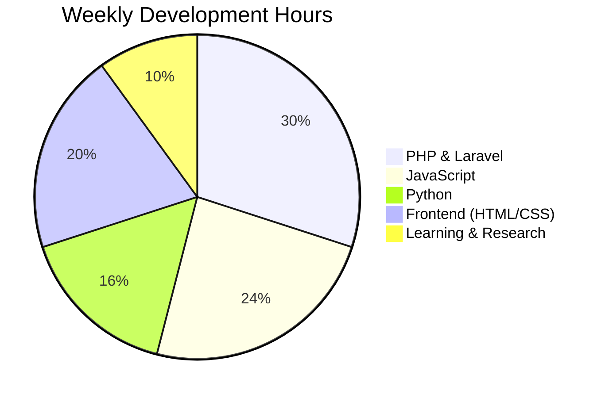

 <div align="center">

<!-- Animated Typing Header -->


<!-- Profile Metrics -->
<div>
  
  
  
  
</div>

<br>

📍 Cabadbaran City, Philippines | ⏰ UTC+8 | 🎓 BSIT Student at Caraga State University

</div>

---

👨‍💻 About Me

```javascript
const developer = {
  name: "Johnny Guzon",
  role: "BSIT Student & Aspiring Developer",
  location: "Cabadbaran City, Philippines",
  education: "Caraga State University - Cabadbaran Campus",
  
  skills: {
    languages: ["PHP", "JavaScript", "Python", "HTML5", "CSS3"],
    frameworks: ["Laravel", "Bootstrap", "React", "Node.js"],
    tools: ["Git", "VS Code", "MySQL", "Firebase", "Figma"],
    databases: ["MySQL", "Firestore", "MongoDB"]
  },
  
  currentlyLearning: ["Advanced Laravel", "React Hooks", "API Development", "System Design"],
  lookingFor: ["Internship Opportunities", "Open Source Collaboration", "Web Dev Projects"],
  philosophy: "Building systems that work, one component at a time.",
  
  contact: {
    email: "guzonjohnny3@gmail.com",
    github: "https://github.com/guzonjohnny3",
    linkedin: "https://linkedin.com/in/johnny-guzon-5127392b5/",
    portfolio: "Coming Soon"
  }
};
```

---

🛠️ Tech Stack

🔥 Core Technologies

<div align="center">

<table>
  <tr>
    <td align="center" width="110">
      
      <br><b>PHP</b>
      <br>
    </td>
    <td align="center" width="110">
      
      <br><b>JavaScript</b>
      <br>
    </td>
    <td align="center" width="110">
      
      <br><b>Python</b>
      <br>
    </td>
    <td align="center" width="110">
      
      <br><b>Laravel</b>
      <br>
    </td>
    <td align="center" width="110">
      
      <br><b>React</b>
      <br>
    </td>
  </tr>
</table>

</div>

🎨 Frontend Development

<div align="center">
  


</div>

⚡ Backend & Databases

<div align="center">
  


</div>

🛠️ Tools & Platforms

<div align="center">
  


</div>

---

 📊 GitHub Analytics

<div align="center">

<!-- GitHub Stats Cards -->
<div style="display: flex; justify-content: center; gap: 20px; flex-wrap: wrap; margin: 30px 0;">


</div>

<!-- GitHub Streak -->


<!-- Activity Graph -->
[](https://github.com/ashutosh00710/github-readme-activity-graph)

<!-- GitHub Trophies -->
<p align="center">
  
</p>

</div>

---

 🚀 Featured Projects

<div align="center">

| Project | Description | Tech Stack | Status |
|---------|-------------|------------|--------|
| 🛒 E-Commerce Platform | Full-featured online store with admin panel | PHP, Laravel, MySQL, Bootstrap | 🚧 In Progress |
| 📋 TaskFlow Pro | Productivity app with real-time collaboration | React, Node.js, Firebase | 📅 Planning |
| 🎓 EduLearn LMS | Learning management system | JavaScript, PHP, MySQL, Bootstrap | 🚧 In Progress |
| 🌐 Portfolio v2 | Modern portfolio with animations | HTML5, CSS3, JavaScript, GSAP | ✅ Completed |
| 🤖 AI Chat Assistant | Intelligent customer support bot | Python, Flask, OpenAI API | 📅 Planning |

</div>

<details>
<summary>📁 View More Projects</summary>

✅ Completed Projects
- Personal Portfolio Website - Responsive design with project showcase
- Weather Dashboard - Real-time weather using API
- Expense Tracker - Personal finance management
- Library Management System - Database CRUD operations
- Blog CMS - Content management system

🚧 In Development
- Social Media Dashboard - Analytics and insights
- Recipe Sharing Platform - Community cooking recipes
- Fitness Tracking App - Workout and health monitoring
- Event Management System - Event planning tool

📅 Planned Projects
- Stock Portfolio Tracker - Investment monitoring
- Code Snippet Manager - Developer productivity tool
- Travel Planning App - Itinerary organizer
- E-Learning Platform - Online course system

</details>

---

 🌐 Connect With Me

<div align="center">

📧 Primary Contact

[](mailto:guzonjohnny3@gmail.com)
[](https://github.com/guzonjohnny3)

💼 Professional Networks

[](https://linkedin.com/in/johnny-guzon-5127392b5/)
[](https://guzonjohnny3.github.io)

🎬 Content & Social Media

[](https://youtube.com/@johnnyguzon?si=BVKDqjkOBXW7vo99)
[](https://www.facebook.com/guzonjohnny3/)
[](https://www.instagram.com/johhnygu/)
[](https://www.tiktok.com/@kuyajohn7087)

💻 Developer Communities

[](https://stackoverflow.com/users/your-id)
[](https://dev.to/guzonjohnny3)
[](https://discord.com/users/your-id)

</div>

---

 📈 Development Activity

<div align="center">

📊 Weekly Coding Distribution


🎯 Current Learning Progress
```text
Laravel Framework    ████████████████░░░░░░░░░   75%
React Fundamentals   ██████████░░░░░░░░░░░░░░░   50%
API Development      █████████████░░░░░░░░░░░░   65%
Database Design      ████████████████░░░░░░░░░   80%
DevOps Basics        ██████░░░░░░░░░░░░░░░░░░░   30%
```

</div>

---

 📚 Learning Journey

<details>
<summary>🎓 Expand Learning Roadmap</summary>

🎯 2024 Learning Goals

Quarter 1-2: Core Development
- [x] Advanced PHP & OOP Principles
- [x] Laravel Framework Fundamentals
- [ ] JavaScript ES6+ Mastery
- [ ] React Hooks & State Management
- [ ] RESTful API Design

#### **Quarter 3-4: Advanced Skills**
- [ ] Database Optimization
- [ ] Testing (PHPUnit, Jest)
- [ ] Docker & Containerization
- [ ] CI/CD Pipelines
- [ ] System Architecture

📖 Learning Resources
- Platforms: Udemy, FreeCodeCamp, Laracasts
- Books: "Clean Code", "Eloquent JavaScript", "PHP Objects"
- Practice: LeetCode, Codewars, Personal Projects
- Communities: GitHub, Stack Overflow, Dev.to

🏅 Certifications in Progress
- [ ] Google IT Automation with Python
- [ ] AWS Cloud Practitioner
- [ ] Microsoft Azure Fundamentals
- [ ] Laravel Certified Developer

</details>

---

 🏆 Achievements

<div align="center">

| Badge | Achievement | Year | Details |
|-------|-------------|------|---------|
| 🥇 | **Dean's Lister** | 2023 | Academic Excellence Award |
| 🎓 | **Web Dev Bootcamp** | 2023 | FreeCodeCamp Certification |
| 💻 | **Hackathon Finalist** | 2023 | Local Coding Competition |
| 🌟 | **GitHub Contributor** | 2024 | Active Open Source Contributions |
| 📚 | **University Projects** | Ongoing | Featured Student Projects |


</div>

---

 📊 Contribution Calendar

<div align="center">


📅 Monthly Statistics
```yaml
Current Month:
  Total Contributions: ████████████ 120
  Pull Requests: ███ 15
  Issues Created: ██ 8
  Code Reviews: █████ 25
  Active Days: ██████████ 20
```

</div>

---

 📝 Blog & Articles

<div align="center">

| Article | Platform | Status | Read Time |
|---------|----------|--------|-----------|
| My Web Development Journey | Dev.to | ✅ Published | 5 min |
| PHP Best Practices Guide | Hashnode | ✅ Published | 7 min |
| Building with Laravel | Medium | 🚧 Draft | 10 min |
| GitHub Portfolio Tips | Personal Blog | ✅ Published | 8 min |

[](https://dev.to/guzonjohnny3)
[](https://hashnode.com/@guzonjohnny3)
[](https://medium.com/@guzonjohnny3)

</div>

---

 🤝 Let's Collaborate!

<div align="center">

 I'm Open To:
```yaml
opportunities:
  internships: "Web Development, Software Engineering"
  freelance: "Small to medium web projects"
  open_source: "Feature development, bug fixes"
  hackathons: "Local or virtual competitions"
  mentorship: "Guidance for junior developers"
```

[](mailto:guzonjohnny3@gmail.com?subject=Job%20Opportunity)
[](mailto:guzonjohnny3@gmail.com?subject=Collaboration)
[](mailto:guzonjohnny3@gmail.com?subject=Mentorship)

</div>

---

 ⚡ Fun Facts & Developer Insights

<div align="center">

```python
import random

class DeveloperFacts:
    def __init__(self):
        self.facts = [
            "I wrote my first HTML at 16 and never stopped coding",
            "I can solve a Rubik's cube in under 2 minutes",
            "My favorite coding snack is coffee ☕ and biscuits",
            "I've contributed to 5+ open source projects",
            "I debug code while listening to lo-fi music 🎵",
            "I believe in writing code that tells a story",
            "My IDE theme is Dracula with custom tweaks",
            "I can type at 85 WPM without looking",
            "I organize my code like I organize my bookshelf 📚",
            "My debugging superpower: Rubber duck method 🦆"
        ]
    
    def get_fact(self):
        return f"✨ **Fun Fact:** {random.choice(self.facts)}"

dev_facts = DeveloperFacts()
print(dev_facts.get_fact())
```

</div>

---

## 🎵 Coding Environment

<div align="center">

### **🖥️ Current Setup**
```yaml
hardware:
  laptop: "Gaming Laptop (16GB RAM, RTX Graphics)"
  monitors: "Dual 24\" IPS Displays"
  keyboard: "Mechanical Keyboard (Brown Switches)"
  mouse: "Wireless Ergonomic Mouse"
  headphones: "Noise-Cancelling Over-Ear"

software:
  os: "Windows 11 Pro"
  terminal: "Windows Terminal + PowerShell 7"
  editor: "VS Code with 50+ extensions"
  theme: "Dracula Official"
  font: "Fira Code with ligatures"
```

### **🎧 Currently Listening To**
[](https://open.spotify.com/user/your-profile)

</div>

---

## 📬 Contact Information

<div align="center">

```yaml
contact_details:
  email: "guzonjohnny3@gmail.com"
  location: "Cabadbaran City, Philippines"
  timezone: "UTC+8 (Philippine Time)"
  availability: "Mon-Fri: 9AM-6PM PHT"
  response_time: "Within 24 hours"
  preferred_method: "Email first, then scheduled call"
```

[](mailto:guzonjohnny3@gmail.com)
[](https://linkedin.com/in/johnny-guzon-5127392b5/)
[](https://calendly.com/guzonjohnny3/30min)

</div>

---

<div align="center">

## 💭 Developer Philosophy

> "First, solve the problem. Then, write the code." - John 
>
> "Clean code always looks like it was written by someone who cares." - Bernadine Cabilogan
>
> "The best way to predict the future is to create it." - Riki Fajardo

📐 My Principles:
1. 🎯 **Problem-First Approach** - Understand before implementing
2. 🔧 **Simplicity** - Complexity only when necessary
3. 📚 **Continuous Learning** - Always be growing
4. 🤝 **Collaboration** - Better together
5. ♻️ **Sustainability** - Code that lasts and evolves

</div>

---

<div align="center">

## 🌟 Support My Journey

If you appreciate my work or want to support my learning:

[](https://buymeacoffee.com/guzonjohnny)
[](https://github.com/sponsors/guzonjohnny3)
[](https://paypal.me/guzonjohnny)

Every bit of support helps me continue learning and building! 🙏

</div>

---

<div align="center">


🔗 Quick Links
[](https://guzonjohnny3.github.io)
[](https://drive.google.com)
[](https://github.com/guzonjohnny3?tab=repositories)

📍 Location:** Cabadbaran City, Philippines  
⏰ Timezone:** UTC+8 (Philippine Time)  
📅 Last Updated:** $(date +"%B %d, %Y")  
📧 Quick Contact:** [guzonjohnny3@gmail.com](mailto:guzonjohnny3@gmail.com)

---
  
"Keep coding, keep learning, keep growing!" 🚀

<br>


</div>
```
